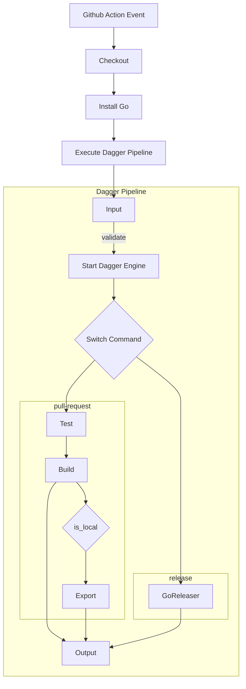

# Dagger Go Example App

This is a simple example application written in Go and a mock test to go along with it. The application makes a request
to `https://icanhazdadjoke.com` which returns a random **dad joke** and prints it to the terminal.

Packaging the application is done with [Dagger](https://dagger.io), [GoReleaser](https://goreleaser.com), and the pipeline executed in [Github Actions](https://docs.github.com/en/actions) on
these events; `pull_request`, `push [tags]`.

The Dagger Pipeline accepts one of two arguments which in turn execute the corresponding task. Below is the flow diagram of the Dagger Pipeline.

## Usage

- clone the repository, or fork your own copy
- create a new branch off `main`
- make your changes
- commit and push your changes to the remote repository
- creating a pull request against `main` will trigger the `pull-request` command
- merge the pull request
- creating a new tag and pushing it to the remote repository will trigger the `release` command
- review your release and publish it when ready

## Local Testing

- clone the repository, or fork your own copy
- create a new branch off `main`
- make your changes and commit them.
- run `go run ./ci/dagger.go --local pull-request` to execute the `pull-request` command locally
- test the binaries in the `dist` directory

---

## Todo

- implement conventional commit validation on every `push` to the repo.
- implement vulnerability scanning in `pull-request` command against the SBOMs generated by `goreleaser`
- implement a automated version bumping on `release` command using `go-sematic-release` and `goreleaser`
- create library package of commands and components to be used in other Dagger Pipelines
